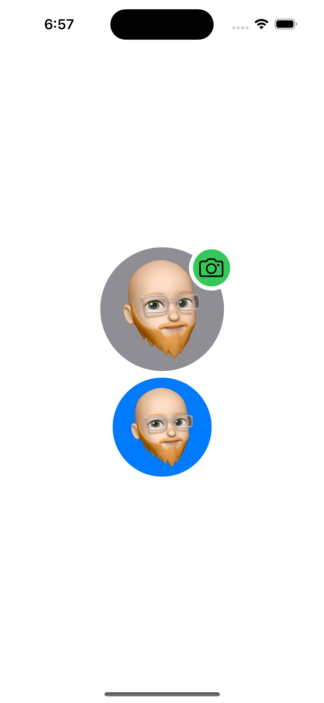

## AvatarActiveIcon

Customizable avatar profile image with customizable activity indicator made with SwiftUI

<picture>

</picture>
<picture>

</picture>

#### Customization
- Avatar size
- Avatar background color
- Show or hide activity indicator
- Activity indicator alignment
- Activity indicator background color
- Activity indicator icon (SF Symbols)
- Activity indicator icon color

#### Use in your code
```swift
AvatarView(
  image: "me2", 
  height: 150, 
  backgroundColor: .gray, 
  showActiveIndicator: true, 
  indicatorAlignment: .topTrailing, 
  iconImage: "camera", 
  activeIndicatorColor: .green, 
  iconColor: .black)
```