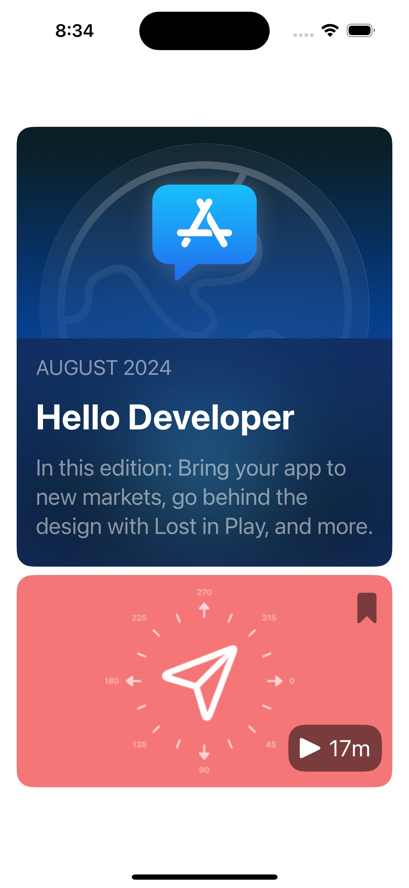
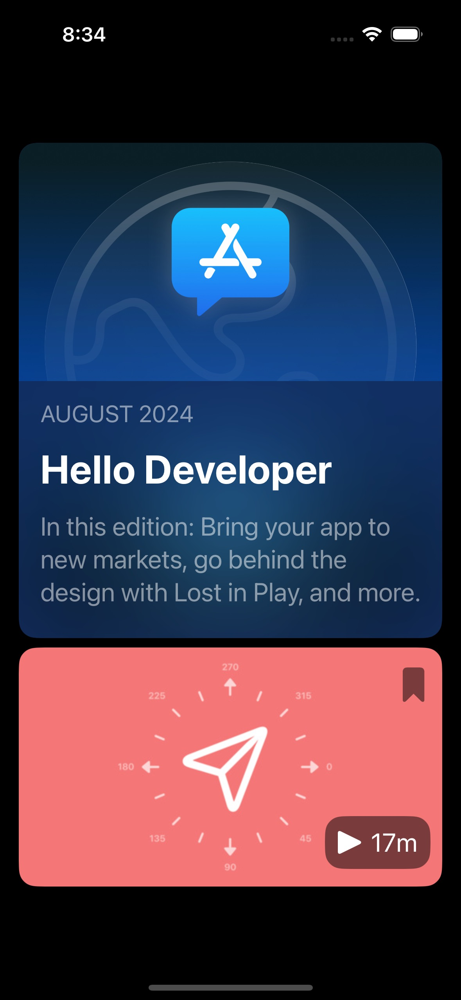

## FeaturePost

Custom feature post card and video post card built in SwiftUI. 
**I copied the design for the FeatureView and VideoPost from Apple's Developer app.**

<picture>

</picture>
<picture>

</picture>

#### Customization (VideoPost)
- Change image background

#### Useage
```swift
FeatureView(date: Date(), title: "Hello Developer", post: "post")
      
VideoPost(background: background, duration: duration)
```