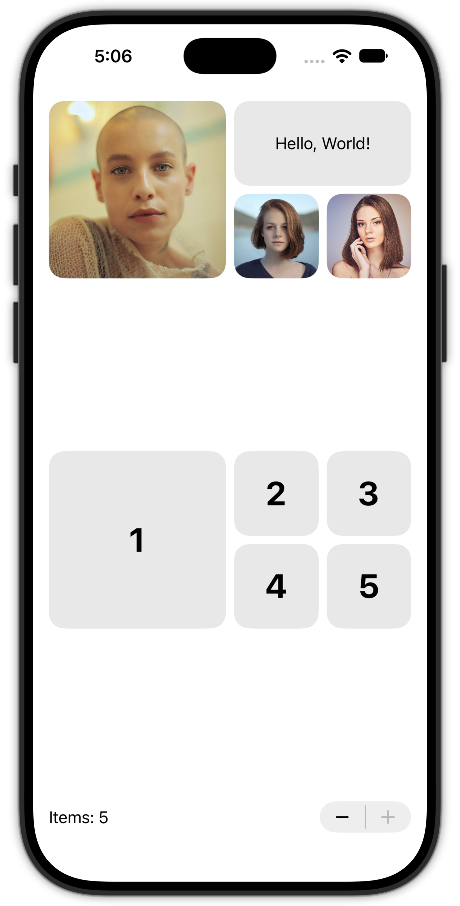
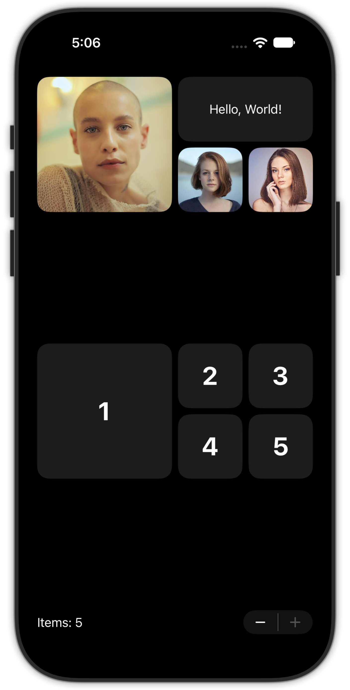

## BentoLayout

My attempt to mimic Apple's Journal app Bento Layout view when adding new journal items. 

iOS: 18.0

<picture>

</picture>
<picture>

</picture>

### Useage
```swift
BentoLayout {
  BentoTile {
    Image("avatar1")
      .resizable()
      .scaledToFill()
  }

  BentoTile {
    Text("Hello, World!")
  }

  BentoTile {
    Image("avatar2")
      .resizable()
      .scaledToFill()
  }

  BentoTile {
    Image("avatar3")
      .resizable()
      .scaledToFill()
  }
}
```

### Photo Attribution
[Photo](https://unsplash.com/photos/woman-in-beige-see-through-top-3ujVzg9i2EI) by [Caique Nascimento](https://unsplash.com/@caiquethecreator?utm_content=creditCopyText&utm_medium=referral&utm_source=unsplash) on [Unsplash](https://unsplash.com/photos/woman-in-beige-see-through-top-3ujVzg9i2EI?utm_content=creditCopyText&utm_medium=referral&utm_source=unsplash)   
[Photo](https://unsplash.com/photos/shallow-focus-photography-of-woman-outdoor-during-day-rDEOVtE7vOs) by [Christopher Campbell](https://unsplash.com/@chrisjoelcampbell?utm_content=creditCopyText&utm_medium=referral&utm_source=unsplash) on [Unsplash](https://unsplash.com/photos/shallow-focus-photography-of-woman-outdoor-during-day-rDEOVtE7vOs?utm_content=creditCopyText&utm_medium=referral&utm_source=unsplash)   
[Photo](https://unsplash.com/photos/woman-with-her-hand-on-cheek-sLGYaQ_stMM) by [x )](https://unsplash.com/@speckfechta?utm_content=creditCopyText&utm_medium=referral&utm_source=unsplash) on [Unsplash](https://unsplash.com/photos/woman-with-her-hand-on-cheek-sLGYaQ_stMM?utm_content=creditCopyText&utm_medium=referral&utm_source=unsplash)   

### Research
Look in to [TupleView](https://developer.apple.com/documentation/swiftui/tupleview)   

- [Why SwiftUI Views Can Not Handle More Than Ten Children?](https://medium.com/@aspteslia/why-swiftui-views-can-not-handle-more-then-ten-children-762584e67a28)
- [Simplifying SwiftUI Layout Switching: HStack vs. VStack](https://paigeshin1991.medium.com/simplifying-swiftui-layout-switching-hstack-vs-vstack-3bf056cc1b76)


#### Hacking with Swift
- [How to automatically switch between HStack and VStack based on size class](https://www.hackingwithswift.com/quick-start/swiftui/how-to-automatically-switch-between-hstack-and-vstack-based-on-size-class)
- [How to dynamically change between VStack and HStack](https://www.hackingwithswift.com/quick-start/swiftui/how-to-dynamically-change-between-vstack-and-hstack)