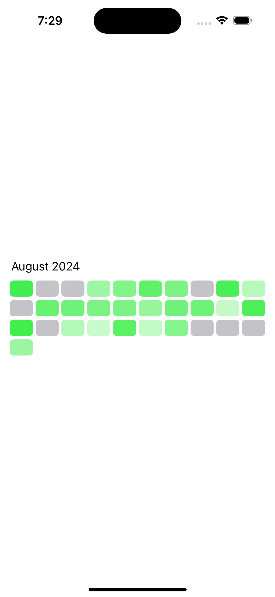
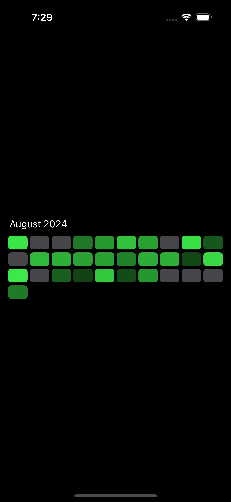

## MonthlyHeatmap

Custom view for a showing a trend heat map that uses SwiftUI Grid to show the trend over the month.

<picture>

</picture>
<picture>

</picture>

#### Customization
- HeatMap Item color

```swift
HeatMapView(date: Date())
```