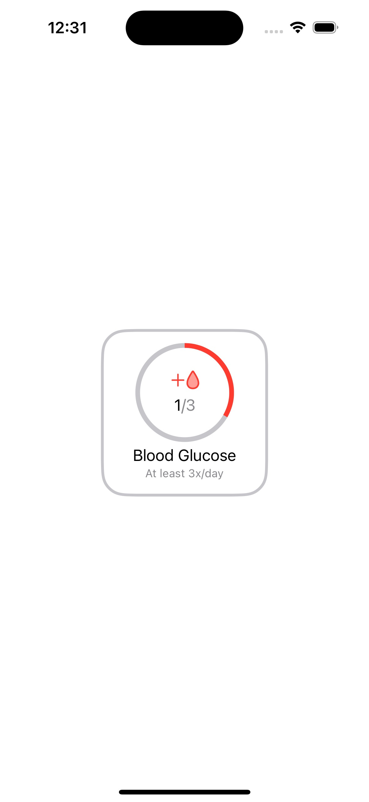
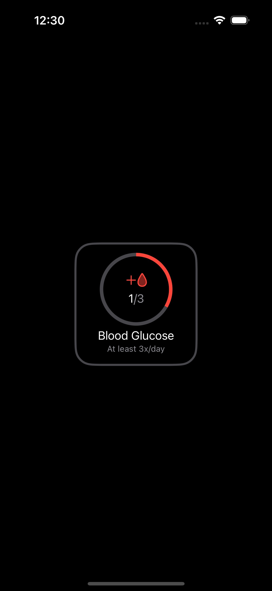

## Biomarker

Custom view for a HealthKit project that uses SwiftUI Gauge to show the progress of tracking the number of reading needed for the day.

<picture>

</picture>
<picture>

</picture>

#### Customization
- Reading Count
- Number of reading
- Gauge line color
- Biomarker icon (SF Symbols)
- Biomarker base color
- Biomarker progress bar color

#### Useage
```swift
BiomarkerView(
      readingCount: readingCount,
      minReading: 0,
      maxReading: 3,
      baseColor: .gray.opacity(0.5),
      progressColor: .red,
      icon: "drop",
      readingType: "Blood Glucose")
```