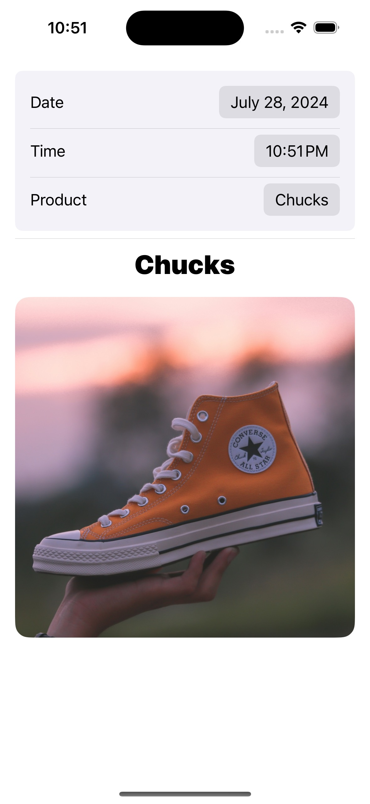
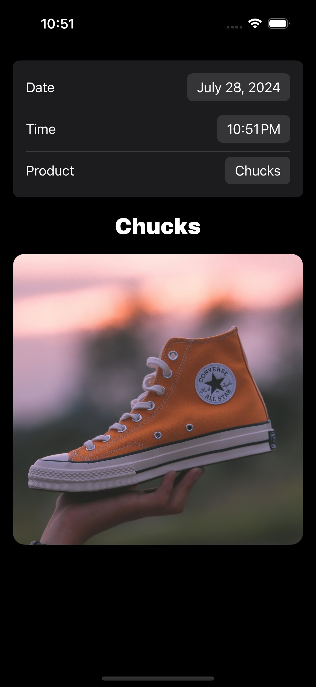
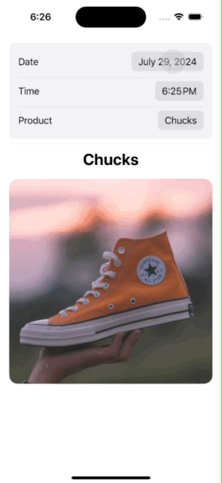

## DateTimeProductPicker

Date, time and product selection view made in SwiftUI. Showcasing animation when selecting between the various pickers and products. 

<picture>

</picture>
<picture>

</picture>
<picture>

</picture>

### Photo Attribution
[Photo](https://unsplash.com/photos/white-crew-neck-long-sleeve-shirt-7cERndkOyDw) by [Mediamodifier](https://unsplash.com/@mediamodifier) on [Unsplash](https://unsplash.com/)   
[Photo](https://unsplash.com/photos/red-and-white-plaid-button-up-shirt-GlgDs6_WhTg) by [Mrushad Khombhadia](https://unsplash.com/@mushyy) on [Unsplash](https://unsplash.com/)   
[Photo](https://unsplash.com/photos/pile-of-blue-denim-jeans-lot-UP9DtTjRYpI) by [Waldemar](https://unsplash.com/@waldemarbrandt67w) on [Unsplash](https://unsplash.com/)   
[Photo](https://unsplash.com/photos/person-wearing-white-nike-air-max-jvJ1O0Uy5XU) by [Théo rql](https://unsplash.com/@theorql) on [Unsplash](https://unsplash.com/)   
[Photo](https://unsplash.com/photos/unpaired-orange-and-white-converse-all-star-high-top-IjzhMi4Cw3w) by [Huyen Nguy](https://unsplash.com/@huyennguy) on [Unsplash](https://unsplash.com/)   