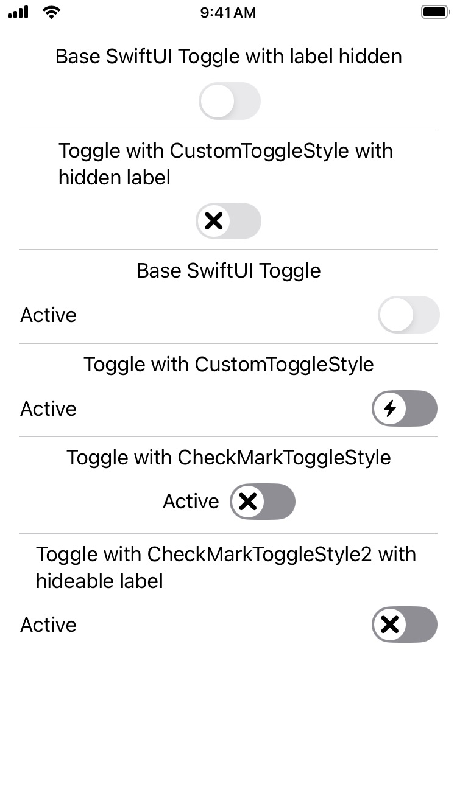
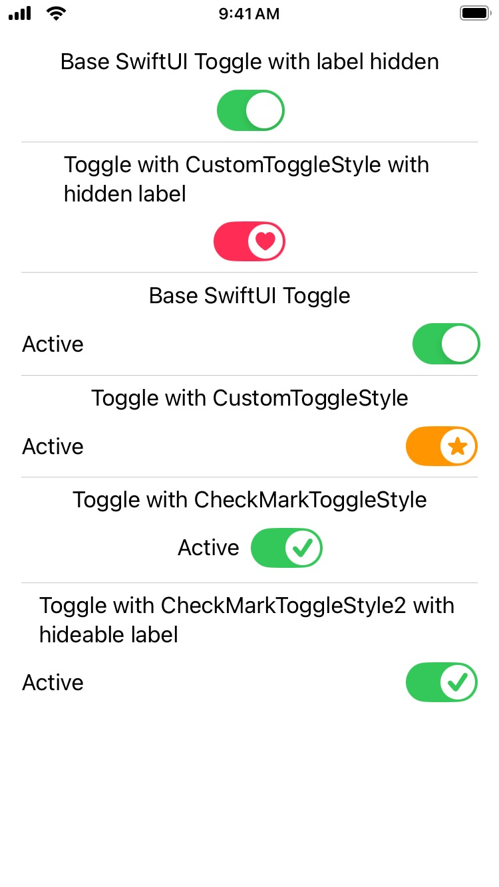
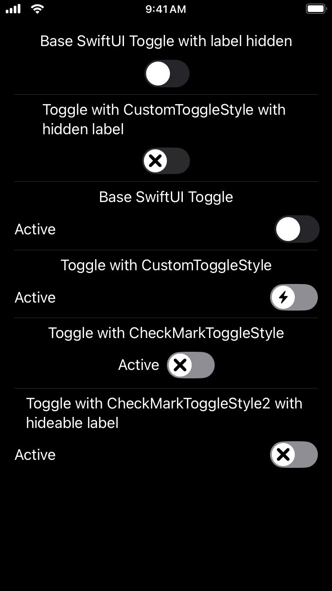
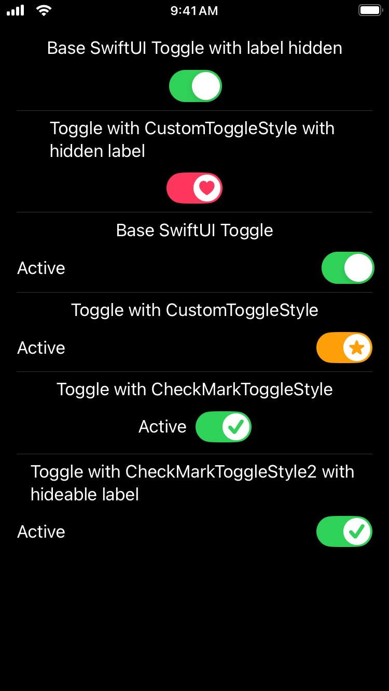

## CustomToggles

A sample project for a custom ToggleStyle for SwiftUI

Light mode
<picture>

</picture>
<picture>

</picture>
Dark mode   
<picture>

</picture>
<picture>

</picture>


#### Customization
- onImage: String (SFSymbol) 
- offImage: String (SFSymbol)
- onColor: Color
- offColor: Color

#### Use in your code
```swift
Toggle(isOn: $isOn, label: {
  Text("Active")
})
  .toggleStyle(CustomToggleStyle(onImage: "heart.fill", onColor: .pink, offColor: .gray.opacity(0.3)))
  .labelsHidden()
```